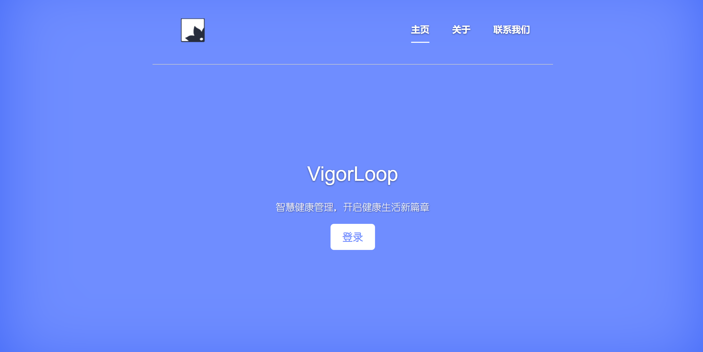
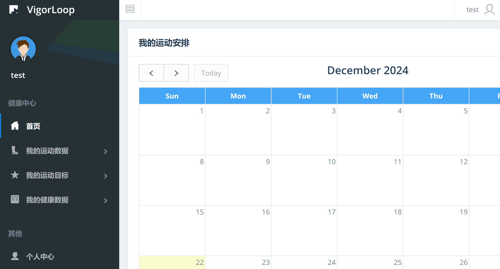

# VigorLoop 运动健康管理系统


欢迎来到 VigorLoop，您的健康管理好伙伴。

在快节奏世界中，VigorLoop 致力于帮助您建立健康的生活方式。

我们提供一个全面的平台，让您轻松跟踪和管理健康记录及运动习惯。

使用 VigorLoop，与我们共同迈向更健康、更活跃的未来。

# 快速部署

1. 安装 `MySQL 8.0` -- [MySQL :: MySQL Downloads](https://www.mysql.com/downloads/)；

2. 安装 `python`，推荐版本 `3.11`-- [Download Python | Python.org](https://www.python.org/downloads/) ；

3. 克隆项目并进入项目根目录，安装依赖；

   ```sh
   git clone https://github.com/heihei877/DB_HealthManagement.git
   
   cd DB_HealthManagement
   
   pip install -r requirements.txt
   ```

4. 在 8000 端口上启动服务器；

   ```sh
   python ./src/manage.py runserver 8000
   ```

5. 在浏览器中打开 http://127.0.0.1:8000/ 访问服务。

# 使用方式
请参考服务内指引，使用侧边栏切换功能：



# 在此基础上继续开发
本项目遵循 MIT 开源协议，欢迎您在此基础上继续开发，下面简要介绍开发流程：

1. 运行 `python ./src/manager.py help` 获取 `Django` 使用方式；
2. 通常，我们选择 `startapp <app_name>` 来创建一个新的 `app` （类似于 `module/package` ）；
3. 在 `app` 的 `model.py` 中创建你的模型，该模型对应数据库中的一张表，模型的属性对应表的属性，`Django` 会为你添加如 `id` 等必要的属性（如未指定主键）；
4. 在 `app` 的 `view.py` 中创建你的视图函数，该函数为网页提供所需数据，可视为数据库与前端显示的中间件；
5. 运行 `python ./src/manager.py makemigrations` 将模型转换为创建数据库表的 `sql` 指令，运行 `python ./src/manager.py migrate` 运行生成的 `sql` 指令。

6. 在浏览器中浏览成果。


# 贡献者
add2333--运动数据、健康数据、用户登录功能实现

heihei877--运动目标、个人中心功能实现

<a href="https://github.com/heihei877/DB_HealthManagement/graphs/contributors">
  
</a>


# 许可证
[MIT license](./LICENSE)
